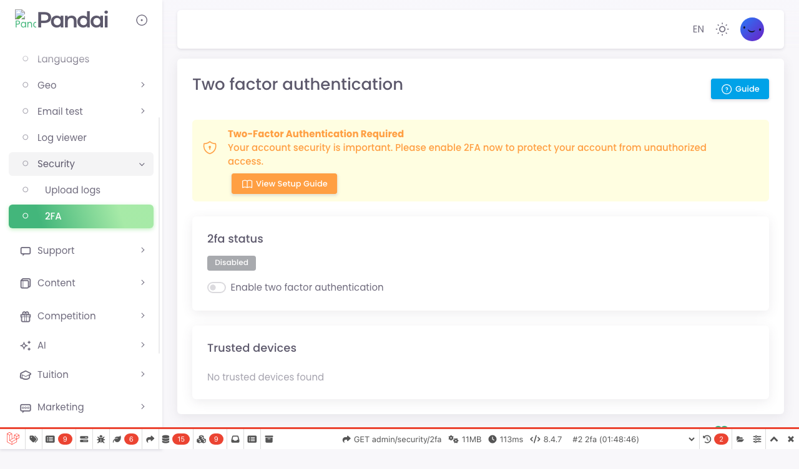

# E2E Test Report — pandai.question

- **Generated:** 2026-05-22T09:28:34.078Z
- **Run started:** 2026-05-21T02:47:11.404Z
- **Total duration:** 42.87 s
- **Passed:** 4 · **Failed:** 0 · **Flaky:** 0 · **Skipped:** 0

## Scenarios

| # | Scenario | Status | Duration |
|---|----------|--------|----------|
| 1 | [Authentication - Login — login page renders the form](#1-login-page-renders-the-form) | ✅ passed | 1.53 s |
| 2 | [Authentication - Login — user baby8 can log in with valid credentials](#2-user-baby8-can-log-in-with-valid-credentials) | ✅ passed | 6.91 s |
| 3 | [Authentication - Login — invalid credentials keep the user on the sign-in page](#3-invalid-credentials-keep-the-user-on-the-sign-in-page) | ✅ passed | 4.12 s |
| 4 | [Classic Quiz (Web) — end-to-end classic quiz flow](#4-end-to-end-classic-quiz-flow) | ✅ passed | 41.49 s |

## <a id="1-login-page-renders-the-form"></a>1. login page renders the form

- **Suite:** Authentication - Login
- **Status:** ✅ passed
- **Duration:** 1.53 s
- **Started:** 2026-05-21T02:47:11.716Z
- **Source:** `auth/login.spec.ts:21`

### Scenario info

```
Title:     login page renders the form
User:      owner
Base URL:  https://pandai.question.test
Started:   2026-05-21T17:48:43.557Z
```

### Steps

**01 · open sign in page**


**02 · verify form is visible**


---

## <a id="2-user-baby8-can-log-in-with-valid-credentials"></a>2. user baby8 can log in with valid credentials

- **Suite:** Authentication - Login
- **Status:** ✅ passed
- **Duration:** 6.91 s
- **Started:** 2026-05-21T02:47:11.729Z
- **Source:** `auth/login.spec.ts:33`

### Scenario info

```
Title:     user baby8 can log in with valid credentials
User:      owner
Base URL:  https://pandai.question.test
Started:   2026-05-21T17:48:43.560Z
```

### Steps

**01 · open sign in page**


**02 · fill credentials**


**03 · submit login form**


**04 · landed on authenticated page**



**Final URL:** `https://pandai.question.test/admin/security/2fa`

---

## <a id="3-invalid-credentials-keep-the-user-on-the-sign-in-page"></a>3. invalid credentials keep the user on the sign-in page

- **Suite:** Authentication - Login
- **Status:** ✅ passed
- **Duration:** 4.12 s
- **Started:** 2026-05-21T02:47:11.712Z
- **Source:** `auth/login.spec.ts:58`

### Scenario info

```
Title:     invalid credentials keep the user on the sign-in page
User:      owner
Base URL:  https://pandai.question.test
Started:   2026-05-21T17:48:43.551Z
```

### Steps

**01 · open sign in page**


**02 · fill wrong credentials**


**03 · submit login form**


**04 · still on sign in page**


**Final URL:** `https://pandai.question.test/app/sign-in`

---

## <a id="4-end-to-end-classic-quiz-flow"></a>4. end-to-end classic quiz flow

- **Suite:** Classic Quiz (Web)
- **Status:** ✅ passed
- **Duration:** 41.49 s
- **Started:** 2026-05-21T02:47:11.717Z
- **Source:** `quiz/classic-quiz.spec.ts:25`

### Scenario info

```
Title:     end-to-end classic quiz flow
User:      dayanaamirah2020
Subject:   English
Base URL:  https://pandai.question.test
Started:   2026-05-21T17:48:43.555Z
```

### Steps

**01 · 1 open website**


---
